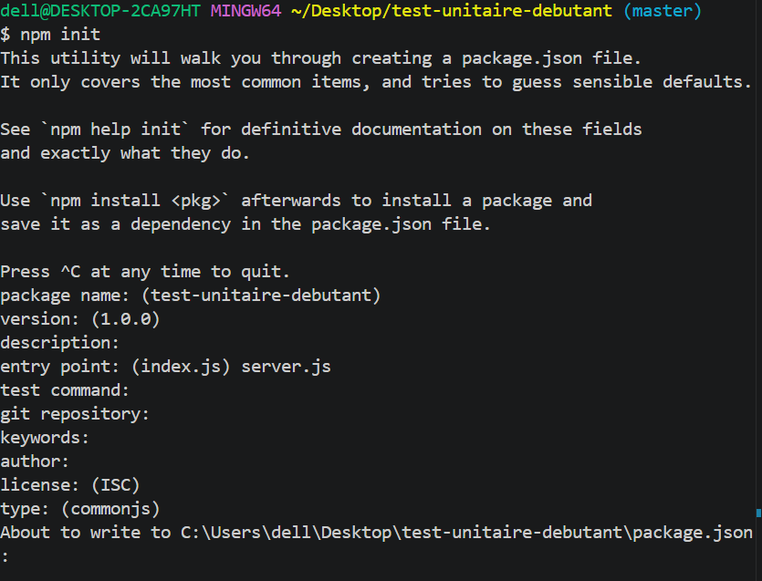
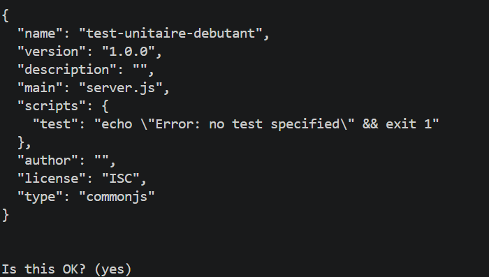
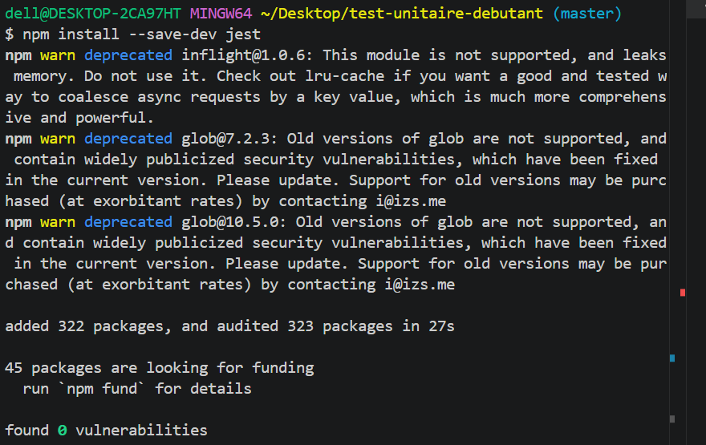
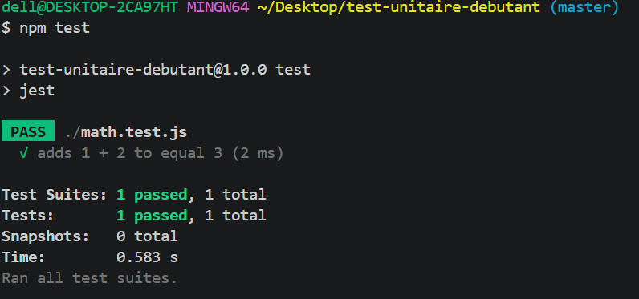
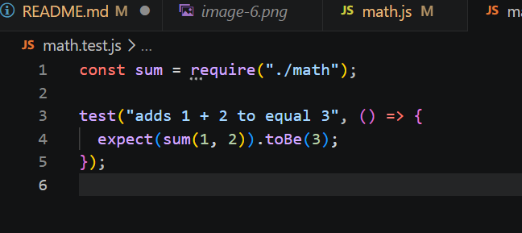
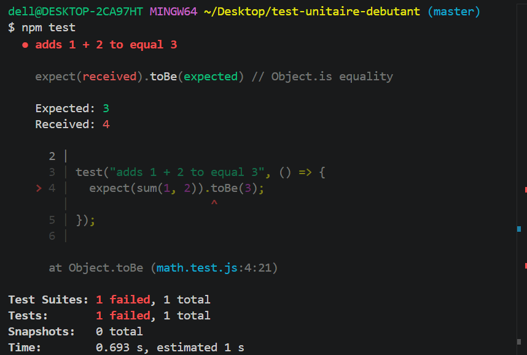

## On initialise le projet nodeJS

On initialise le projet nodeJS avec la commande npm init

## On installe jest

On installe jest avec la commande npm install --save-dev jest

## On configure le package.json

## On lance un test avec jest et on voit bien qu'il passe

## On modifie volantairement le code pour le faire échouer

Après avoir lancé npm test on obtient bien l'erreur

